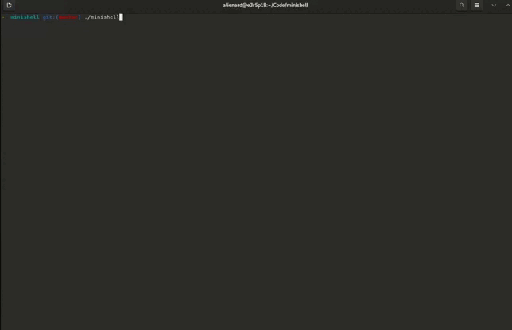

42 Paris project - minishell

Recoding a shell in C    

First non-solo project of the cursus, realised with [Clement Dai](https://github.com/DaiClement)

	

Goals :

- introduce us to the processes through fork, wait, kill
- gain a deeper understanding of file descriptors
- step up in termes of parsing and error handling
- understand and implement the notions of
	- parser-lexer
	- tokeniser
	- abstract syntax tree 

Since it was a very demanding project in terms of edge-cases, I implemented [my own tester](https://github.com/lienardale/alientest_minishell), which helped us :
- advance in our work without breaking what was previously working
- compile future tests for future work
- get a glimpse of Test Driven Development

Features : 

- Writes a prompt waiting for a new command
- Searches and launches the right executable (based on the PATH environment variable, or using a relative or absolute path)
- Builtins cmds :
	- echo
	- cd
	- pwd
	- export
	- unset
	- env
	- exit

- Handles ';', single and double quotes (except in multiline), and the use of '\\'
- Redirections : '<', '>' and '>>'
- Pipes
- Environment variables
- Return values ("echo $?")
- Signals : ctrl-C, ctrl-D, ctrl-\
